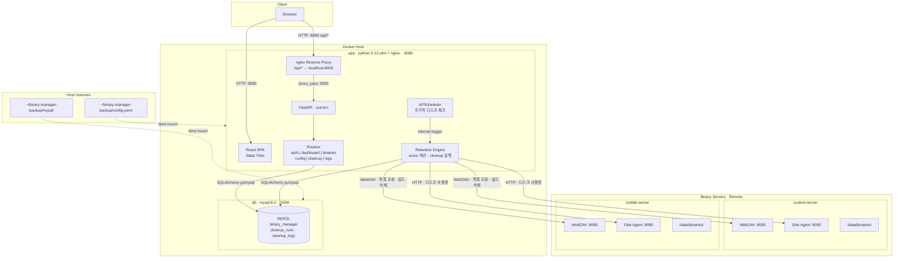

# Binary Retention Manager

Android 빌드 바이너리 보관 관리 도구. 원격 바이너리 서버의 디스크 사용량을 모니터링하고, 설정된 보관 정책에 따라 빌드를 자동 삭제합니다.

## 아키텍처

### Deployment View



### 클린업 흐름

```mermaid
sequenceDiagram
    participant B as Browser
    participant N as Nginx
    participant F as FastAPI
    participant DB as MySQL
    participant S as Binary Server

    rect rgb(40, 40, 60)
        Note right of B: 사용자 요청
        B->>N: GET /api/dashboard/stats
        N->>F: proxy_pass
        F->>DB: SELECT cleanup stats
        DB-->>F: results
        F-->>N: JSON
        N-->>B: 200 OK
    end

    rect rgb(60, 40, 40)
        Note right of F: 자동 클린업 (Scheduler, 서버별)
        F->>S: HTTP: Disk Agent /disk-usage
        S-->>F: 92% used
        Note over F: 90% 초과 → 클린업 시작
        F->>S: WebDAV: PROPFIND (빌드 목록)
        S-->>F: build list + mtime
        Note over F: score = priority×1000 + remaining_days×10
        loop score 낮은 순서대로 삭제
            F->>S: WebDAV: DELETE build
            S-->>F: 200 OK
            F->>S: HTTP: Disk Agent /disk-usage (재확인)
            S-->>F: 83% used
        end
        Note over F: 80% 이하 → 클린업 종료
        F->>DB: INSERT cleanup_runs, cleanup_logs
    end
```



### 컴포넌트 역할

- **app 컨테이너**: nginx + uvicorn을 supervisord로 단일 컨테이너에서 실행
  - **nginx**: React SPA를 서빙하고 `/api/*` 요청을 로컬 uvicorn으로 리버스 프록시
  - **FastAPI**: 보관 정책 로직, 스케줄링, 정리 작업 오케스트레이션 담당
- **WebDAV**: 바이너리 서버의 빌드 목록 조회 및 삭제에 사용
- **Disk Agent**: 바이너리 서버에 설치하는 경량 HTTP 에이전트 (디스크 사용량/디렉토리 크기 조회)
- **MySQL**: 정리 실행 이력 및 로그 저장 (별도 컨테이너로 실행)

## 기술 스택

| 계층 | 기술 |
|---|---|
| Backend | Python 3.12, FastAPI, SQLAlchemy (MySQL), webdavclient3, httpx, APScheduler |
| Frontend | React 18, TypeScript, Vite, Tailwind CSS, Recharts, lucide-react |
| Infra | Docker Compose, nginx, supervisord |

## 프로젝트 구조

```
Dockerfile                       # 멀티스테이지 빌드 (프론트엔드 빌드 + Python/nginx/supervisord)
nginx.conf                       # 리버스 프록시 (/api/ → localhost:8000) + SPA 서빙
supervisord.conf                 # 단일 컨테이너에서 uvicorn + nginx 실행
docker-compose.yml               # db + app (2개 서비스)
setup.sh                         # 초기 설정 스크립트

disk-agent/
  disk_agent.py                  # 바이너리 서버용 디스크 사용량 HTTP 에이전트 (stdlib only)

backend/
  app/
    main.py                  # FastAPI 진입점, CORS, lifespan
    config.py                # YAML 설정 로더 (Pydantic 모델)
    auth.py                  # JWT 인증 (공유 비밀번호)
    database.py              # MySQL 엔진 + 세션
    models.py                # SQLAlchemy 모델 (CleanupRun, CleanupLog)
    schemas.py               # Pydantic 요청/응답 스키마
    routers/
      auth_router.py         # 로그인 엔드포인트
      dashboard_router.py    # 대시보드 통계
      binaries_router.py     # 바이너리 목록 조회 및 삭제
      config_router.py       # 설정 조회/수정
      cleanup_router.py      # 수동 정리 실행 및 상태 조회
      logs_router.py         # 정리 실행/로그 이력
    services/
      retention_engine.py    # 보관 점수 계산 및 정리 로직
      webdav_service.py      # WebDAV 파일 목록/삭제 (캐싱 포함)
      disk_agent_service.py  # Disk Agent HTTP 클라이언트 (디스크 사용량/크기)
      scheduler_service.py   # APScheduler 주기적 디스크 점검
      cleanup_log_service.py # 정리 실행/로그 DB 작업
  tests/
    test_retention_engine.py # 보관 점수 계산 단위 테스트
  config.yaml                # 런타임 설정
  requirements.txt

frontend/
  src/
    api/client.ts            # Axios 인스턴스 (JWT 인터셉터)
    context/AuthContext.tsx   # 인증 상태 관리
    components/
      Layout.tsx             # 사이드바 포함 앱 셸
      Sidebar.tsx            # 네비게이션 사이드바
      DiskUsageGauge.tsx     # 디스크 사용량 원형 게이지
      ProjectTable.tsx       # 프로젝트 목록 테이블
      RetentionBadge.tsx     # 보관 유형 뱃지
    pages/
      LoginPage.tsx          # 로그인 폼
      DashboardPage.tsx      # 디스크 사용량 통계 및 정리 제어
      BinaryListPage.tsx     # 보관 정보 포함 프로젝트 목록
      ProjectDetailPage.tsx  # 프로젝트별 빌드 목록
      SettingsPage.tsx       # 설정 편집기
      LogsPage.tsx           # 정리 이력 뷰어
```

## 빠른 시작

### 초기 설정

최초 실행 전 설정 파일과 DB를 초기화합니다:

```bash
./setup.sh
```

이 스크립트는 `~/binary-manager-backup/` 폴더에 다음을 생성합니다:
- `config.yaml` - 런타임 설정 (소스의 기본 설정 복사)
- `mysql/` - MySQL 데이터 디렉토리

MySQL DB는 첫 실행 시 자동으로 초기화되며, 이미 파일이 존재하면 덮어쓰지 않아 기존 데이터가 보존됩니다.

### 데모 모드 (기본값)

데모 모드는 실제 바이너리 서버 없이 UI를 탐색할 수 있도록 가짜 데이터를 생성합니다.

```bash
docker compose up --build
```

http://localhost:8080 접속 후 비밀번호 `changeme`로 로그인합니다.

### 프로덕션 모드

1. 각 바이너리 서버에 Disk Agent 설치:

```bash
# 바이너리 서버에서 실행
python3 disk_agent.py --path /data/binaries --port 9090
```

2. `backend/config.yaml` 수정:

```yaml
demo_mode: false

binary_servers:
  - name: "custom"
    webdav_url: "http://custom-server:8080"
    disk_agent_url: "http://custom-server:9090"
    binary_root_path: "/data/binaries"
    trigger_threshold_percent: 90
    target_threshold_percent: 80
    check_interval_minutes: 5
  - name: "mobile"
    webdav_url: "http://mobile-server:8080"
    disk_agent_url: "http://mobile-server:9090"
    binary_root_path: "/data/binaries"
    trigger_threshold_percent: 90
    target_threshold_percent: 80
    check_interval_minutes: 5

auth:
  shared_password: "your-secure-password"
  jwt_secret: "your-random-secret"
```

3. 시작:

```bash
docker compose up --build -d
```

## 설정

`backend/config.yaml`로 모든 런타임 동작을 제어합니다:

| 섹션 | 키 | 설명 |
|---|---|---|
| `demo_mode` | `true/false` | UI 테스트용 가짜 데이터 활성화 |
| `binary_servers[]` | `name` | 서버 식별 이름 |
| | `webdav_url` | 파일 목록 조회/삭제용 WebDAV 엔드포인트 |
| | `disk_agent_url` | 디스크 사용량 조회용 Disk Agent 엔드포인트 |
| | `binary_root_path` | 서버상 바이너리 루트 디렉토리 |
| | `trigger_threshold_percent` | 정리 시작 디스크 사용률 (기본값: 90) |
| | `target_threshold_percent` | 정리 중단 디스크 사용률 (기본값: 80) |
| | `check_interval_minutes` | 디스크 사용량 점검 주기 (기본값: 5분) |
| `retention_types` | `name`, `retention_days`, `priority` | 이름별 보관 정책 |
| `project_mappings` | `pattern`, `type` | glob 패턴 → 보관 유형 매핑 |
| `auth` | `shared_password`, `jwt_secret` | 인증 자격 증명 |

## 보관 알고리즘

### 점수 공식

```
score = priority * 1000 + remaining_days * 10
```

- **낮은 점수 = 먼저 삭제**
- `priority`로 빌드 유형별 그룹화 (예: nightly=1, release=3)
- 동일 priority 내에서 만료일에 가까운 빌드가 먼저 삭제됨
- 만료된 빌드는 `remaining_days`가 음수이므로 점수가 더 낮아짐

### 히스테리시스 (서버별 설정)

| 임계값 | 기본값 | 동작 |
|---|---|---|
| Trigger | 90% | 디스크 사용률이 이 값을 초과하면 삭제 시작 |
| Target | 80% | 디스크 사용률이 이 값 아래로 내려가면 삭제 중단 |

각 서버마다 독립적으로 trigger/target을 설정할 수 있으며, trigger와 target 사이의 간격으로 정리 작업의 빈번한 on/off 반복을 방지합니다.

### 안전 장치

- **업로드 보호**: 최근 10분 이내 수정된 빌드는 건너뜀 (업로드 중인 빌드 보호)
- **WebDAV 캐시**: 파일 목록 결과를 60초간 캐싱

## API 엔드포인트

health와 login을 제외한 모든 엔드포인트는 `Authorization: Bearer <token>` 헤더를 통한 JWT 인증이 필요합니다.

| 메서드 | 경로 | 설명 |
|---|---|---|
| GET | `/api/health` | 헬스 체크 |
| POST | `/api/auth/login` | 비밀번호로 로그인, JWT 토큰 반환 |
| GET | `/api/dashboard/stats` | 디스크 사용량, 프로젝트/빌드 수, 정리 상태 |
| GET | `/api/binaries` | 보관 정보 포함 전체 프로젝트 목록 |
| GET | `/api/binaries/{project}` | 프로젝트별 빌드 목록 (점수 포함) |
| DELETE | `/api/binaries/{project}/{build}` | 특정 빌드 삭제 |
| GET | `/api/config` | 현재 설정 조회 |
| PUT | `/api/config` | 설정 수정 |
| POST | `/api/config/test-connection` | 서버 연결 테스트 (WebDAV + Disk Agent) |
| POST | `/api/cleanup/trigger` | 수동 정리 실행 (dry-run 지원) |
| GET | `/api/cleanup/status` | 현재 정리 작업 상태 조회 |
| GET | `/api/logs/runs` | 정리 실행 이력 (페이지네이션) |
| GET | `/api/logs` | 정리 로그 (페이지네이션, 실행 ID 필터) |

## 개발

### 개발 모드

로컬에서 백엔드와 프론트엔드를 각각 실행하여 개발합니다:

```bash
# 백엔드 (터미널 1)
cd backend && uvicorn app.main:app --reload --port 8000

# 프론트엔드 (터미널 2)
cd frontend && npm run dev
```

### 배포

확인이 완료되면 Docker 이미지로 빌드하여 배포합니다:

```bash
# 최초 1회
./setup.sh

# 빌드 및 실행
docker compose up --build -d

# 로그 확인
docker compose logs -f app
```

http://localhost:8080 접속 → 비밀번호 `changeme`로 로그인

| 변경 대상 | 반영 방식 |
|-----------|----------|
| `backend/app/**/*.py` | `docker compose up --build -d` |
| `frontend/src/**` | `docker compose up --build -d` |
| `config.yaml` | `docker compose restart app` |
| `requirements.txt` / `package.json` | `docker compose up --build -d` |

### 테스트

```bash
cd backend && python -m pytest tests/ -v
```

### Docker 명령어

```bash
docker compose up --build -d    # 빌드 및 시작
docker compose down             # 중지 및 제거
docker compose ps               # 컨테이너 상태 확인
docker compose logs -f app      # 앱 로그 실시간 확인
```

## UI 페이지

| 페이지 | 설명 |
|---|---|
| **Login** | 공유 비밀번호 인증 |
| **Dashboard** | 디스크 사용량 게이지, 프로젝트/빌드 통계, 수동 정리 실행 (dry-run 옵션 포함) |
| **Binaries** | 보관 유형 및 빌드 수가 포함된 프로젝트 테이블; 개별 빌드의 점수 및 만료일 확인 |
| **Settings** | 서버 관리 (WebDAV/Agent URL, 디스크 임계값), 보관 유형, 프로젝트 매핑 편집, 연결 테스트 |
| **Logs** | 정리 실행 이력 및 실행별 상세 로그 |
